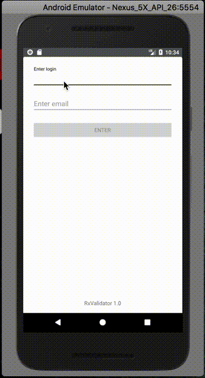

# RxValidator2
The simplest way to add reactive validation to your app

[](https://jitpack.io/#whalemare/rxvalidator2)
[](https://codebeat.co/projects/github-com-whalemare-rxvalidator2-master)
[](https://travis-ci.org/whalemare/RxValidator2)
[](https://android-arsenal.com/api?level=14)
[](https://opensource.org/licenses/Apache-2.0)




How it works
------------
### Problem:

in your application, there are fields that must be validated. 
When the number of validation rules becomes greater than 1, to control the display of errors in the fields becomes difficult.

### Solve
Separate your validation logic by S in SOLID, into own classes. 
After that, attach validaton rules to your fields and combine validation results for change some ui states (ex. change visibility of button)

Usage
-----
### View layer
Firstly, you need write your own rules validation for some fields. 

```kotlin
class NotNullRule : ValidateRule {
    override fun errorMessage() = "Text must not be null"
    
    override fun validate(data: String?): Boolean {
        return data != null // your validation logic
    }
}
```


Attach your validation rules to field

```kotlin
val loginObservable: Observable<Boolean> = RxValidator(editLogin)
        .apply {
            addRule(NotEmptyRule())
            addRule(MinLengthRule(5))
        }.asObservable()
        
val emailObservable: Observable<Boolean> = RxValidator(editEmail)
        .apply {
            addRule(NotEmptyRule())
            addRule(MinLengthRule(7))
        }.asObservable()
```

Combine your validation results to change button state 

```kotlin
RxCombineValidator(loginObservable, emailObservable)
        .asObservable()
        .distinctUntilChanged()
        .subscribe({ valid ->
            button.isEnabled = valid
        })
```

### Model layer
Create text watcher for your field

```kotlin
RxValidator.createObservable(editEmail)
        .subscribe({
            mainPresenter.onEmailTextChanges(it)
        })
```

Add some validation and handle events without rx

```kotlin
val validator = Validator().apply {
    addRule(NotNullRule())
    addRule(NotEmptyRule())
}
    
fun onEmailTextChanges(text: String) {
    validator.validate(text,
            onSuccess = {
                view?.onEmailValid()
            },
            onError = { errorMessage ->
                view?.onEmailInvalid(errorMessage)
            })
}
```

Why
---
* You can use it in model layer, for consistent architecture rules
* You can use it in view layer, with rx wrappers
* You need test only your custom validation rules, because the main features of the library are already covered by tests 


Install
-------

Be sure, that you have `Jitpack` in your root gradle file

```
allprojects {
    repositories {
      jcenter()
      maven { url "https://jitpack.io" }
    }
}
```

Include dependency with `RxValidator` in your app.gradle file with:

```groovy
compile 'com.github.whalemare:RxValidator2:1.0.1'
```


License
-------

    Licensed under the Apache License, Version 2.0 (the "License");
    you may not use this file except in compliance with the License.
    You may obtain a copy of the License at

       http://www.apache.org/licenses/LICENSE-2.0

    Unless required by applicable law or agreed to in writing, software
    distributed under the License is distributed on an "AS IS" BASIS,
    WITHOUT WARRANTIES OR CONDITIONS OF ANY KIND, either express or implied.
    See the License for the specific language governing permissions and
    limitations under the License.
